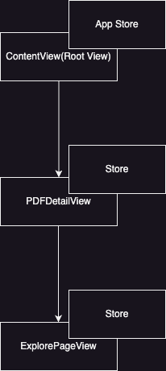
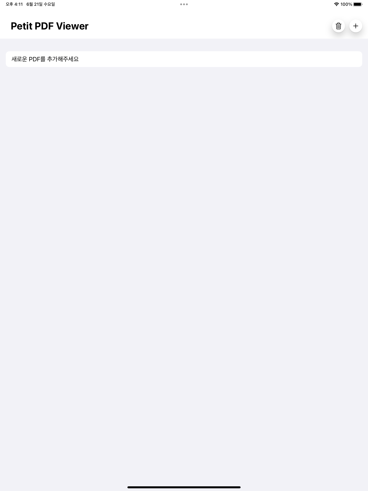
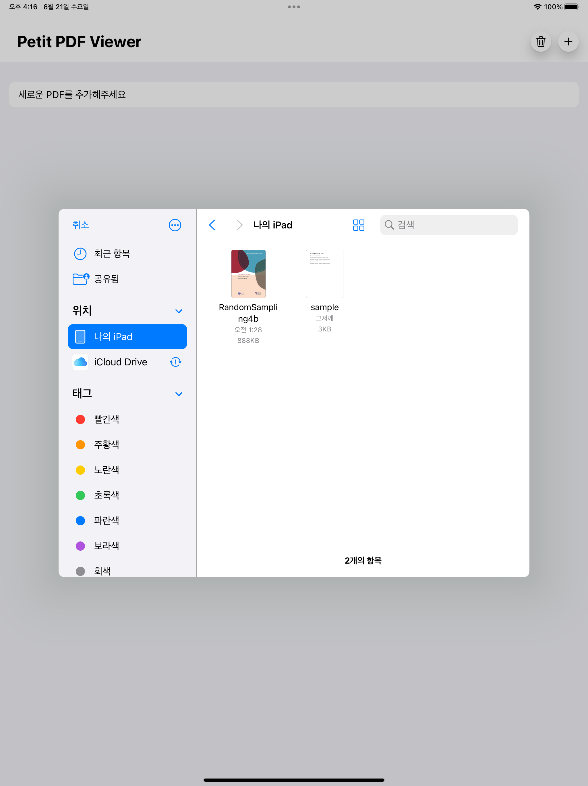
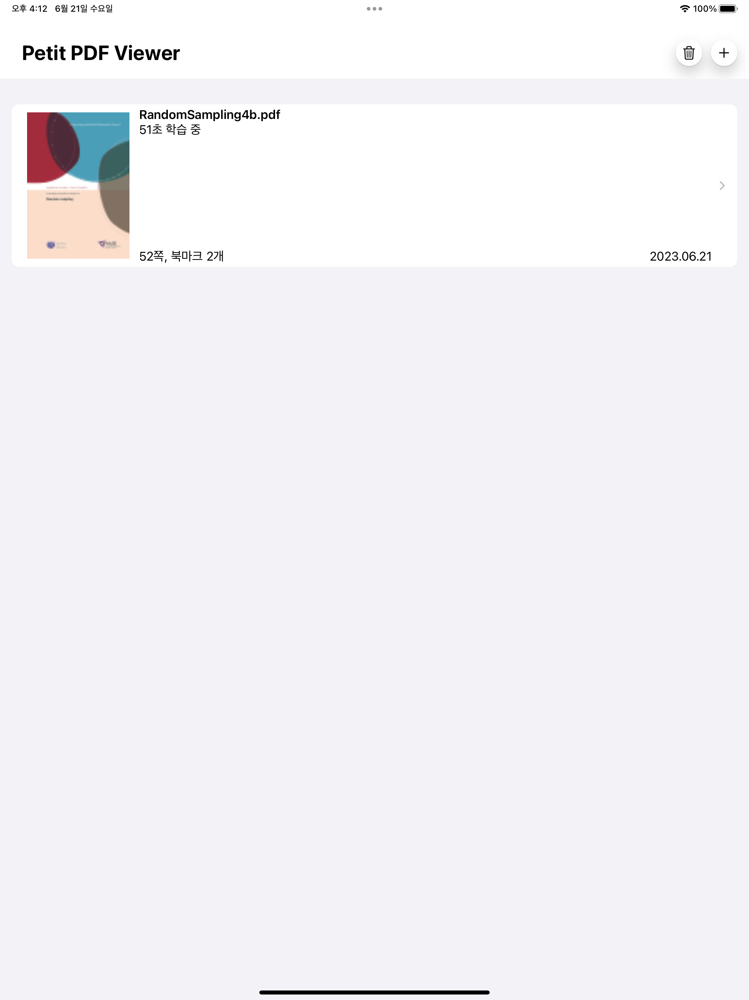
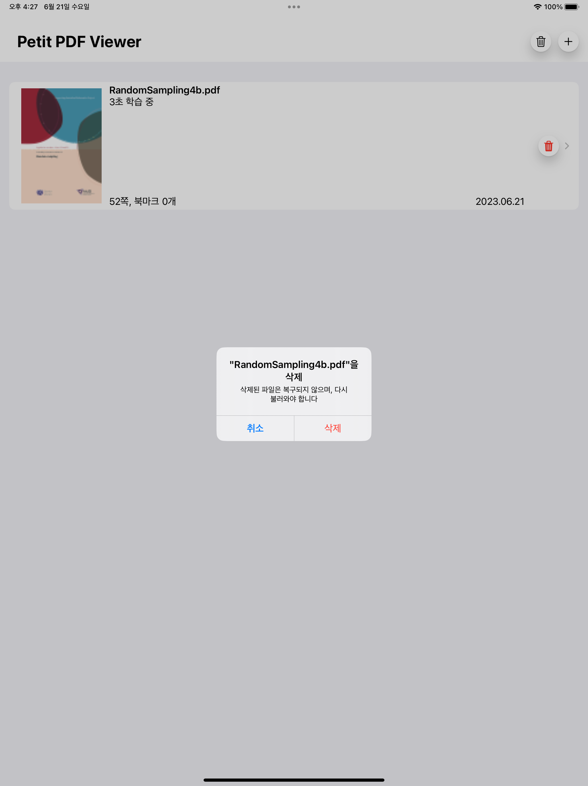
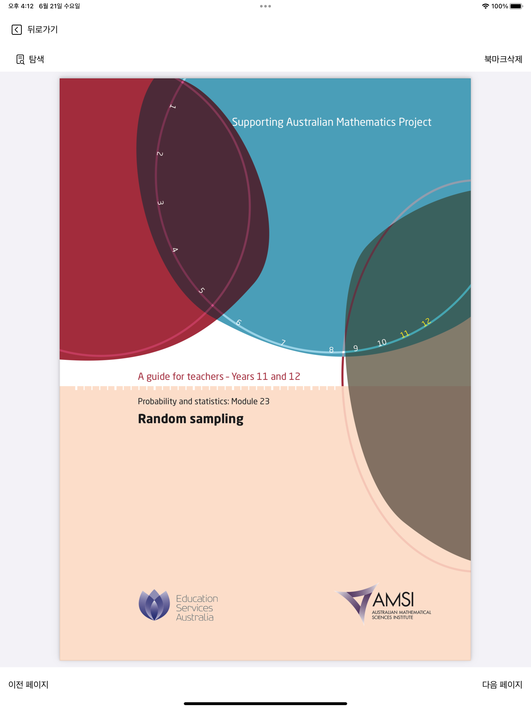
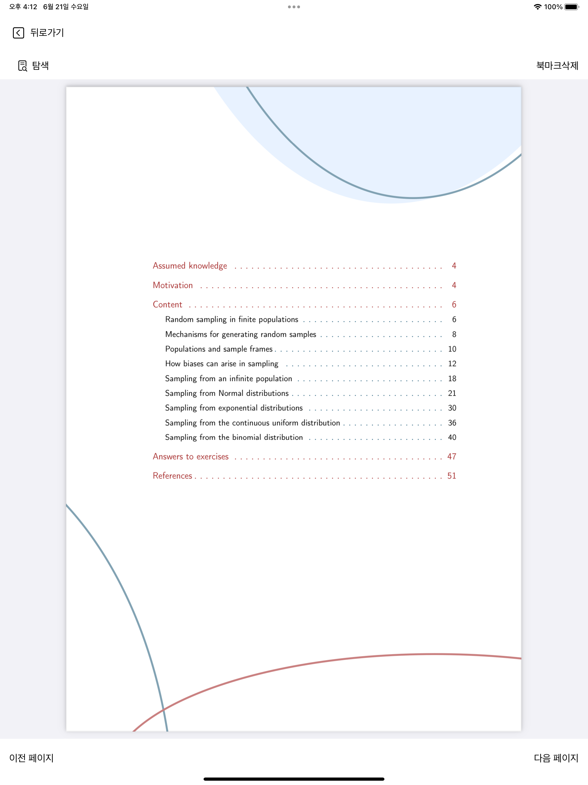
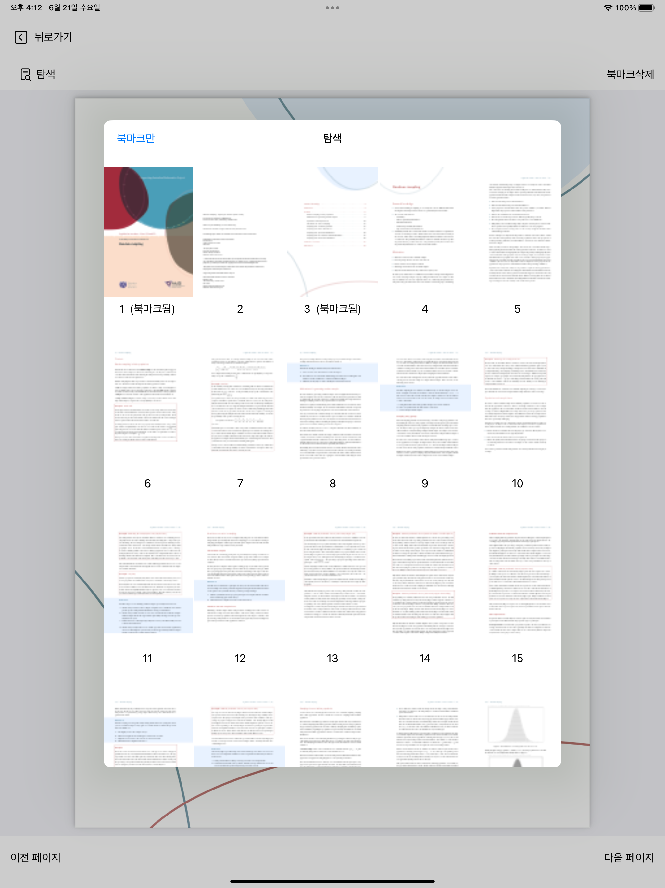
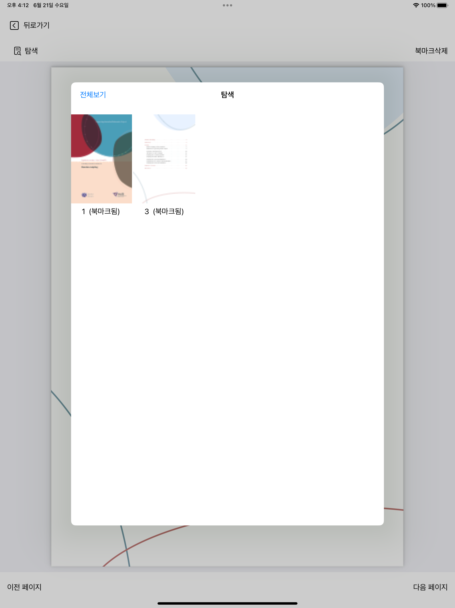
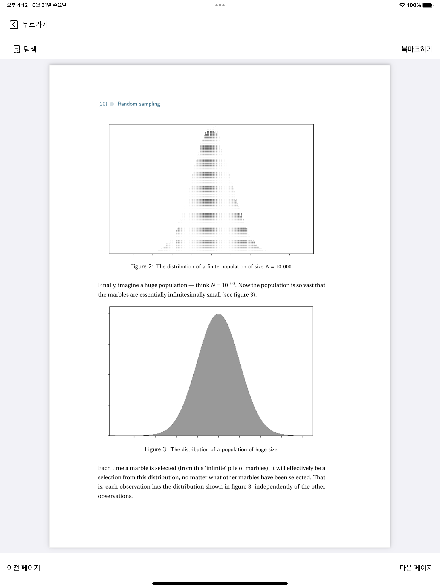

## TCA pre-release 1.0 버전 학습을 위한 repo

1. 뷰 하이어라키

2. 기능목록

메인뷰

- FileImporter를 통해 PDF파일 추가 제거 기능
- 유저가 PDF의 detail뷰로 넘어간 시간을 받아와서 학습시간 보여주는 기능.
- 삭제 toggle 활성화 후 삭제기능

2. 페이지 별 기능

PDF 디테일 뷰

- API통신을 하여, 북마크 추가 및 삭제
- 버튼과 스와이프 총 두가지로 페이징 구형

PDF 탐색 뷰

- PDF의 전체페이지 조회, 및 북마크된 페이지 토글로 조회 가능
- 선택된 페이지로 즉시 이동
